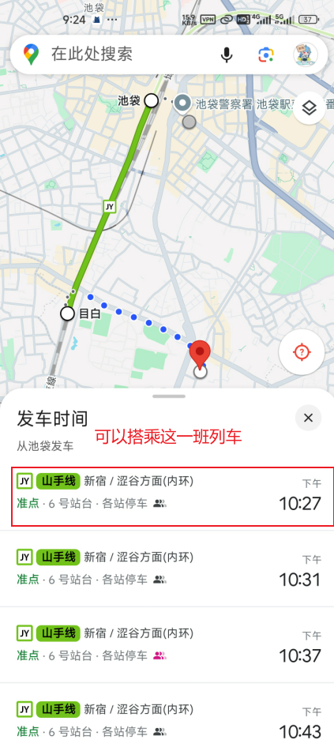

# 赴日旅游攻略

阅读本攻略前可以先看看这篇攻略 [📜 魚の日本自由行攻略(2023Final)](https://blog.sakanano.moe/posts/2024_japan_travel_with_myself)，视频版 [📺 日本1人自由行，40min通关](https://www.bilibili.com/video/BV1dx4y1a7te)，本篇攻略会根据自己的实际旅游体验补充这篇攻略中没有提到的部分。

<!--truncate-->

## 准备期

### 杂货箱

**护照：** 有了护照才能办签证，护照相当于国际身份证，在支付宝搜“移民局12367”，查询当地的办证机构

**签证：** 现在的单次签证都是电子签，提交材料也都是电子的。签证没必要打印，用不到，没人看。

**海关电子QRcode申报：** [📺 2024日本北海道机场入境实拍攻略+最新海关电子QRcode申报教程](https://www.bilibili.com/video/BV1Hx4y1Q7td)，提前一周填好。

**飞机出境：** [📺 没体验过坐飞机？飞机购票、乘机超详细实拍指南来了，在毕业前、工作后有出游计划的小伙伴先学起来。心里有底，I人不怕！！！！](https://www.bilibili.com/video/BV1BfxCekEE2)

### 日元

建议多换点，虽然日本的很多地方都能用微信支付宝，但是还是有些地方不能用的，比如：超市，新干线，充值 IC 卡。这里给个参考，我游玩 11 天换了 5w 日元，最后只剩 1k 日元了。日本的电子支付没有国内这么普及，所以日元可以多换点，大不了直接花现金，如果嫌弃硬币太多了，可以把钱冲到 IC 卡中，刷 IC 卡消费，感觉 IC 卡比微信支付宝普及。

硬币太多了怎么办？本人想到的两个办法：

1. 用零散的硬币到便利店里买水或买其他东西
2. 充值到 IC 卡里。在电车站里可能会有一个叫“精算器”的机器，有些“精算器”是可以给 IC 卡充值的，最低支持 10 日元的硬币。“精算器”还有其他作用，比如你乘车过程中换乘了，刷卡出站的时候可能闸机会报红，这时候你可以用“精算器”给 IC 卡消记录，也可以到找到服务人员操作。

### 日本流量卡

用的最多的应该是“Softbank白卡”（贵点）和“亿点连接”（便宜点）。在日本大部分地区都是 4G 网路，也可能是我手机设备的问题。

“Softbank白卡” 是日本服务商的原生卡，采用的总量计费。我买的是 10 天 10 G，在第 11 天的时候还能用，流量大概剩了 5 G。“亿点连接” 是按天计费。

可以多买一张卡备用，以应对飞机落地后连不上网。本人多买了一张 3 天的“亿点连接”卡。

**国际漫游：** 可以看看这篇小红书的文章 [📜 国际漫游和数据漫游是有区别的！](https://www.xiaohongshu.com/explore/67287a5e000000001b02f5dd?xsec_token=ABMP8UwkwuX6x0WIiCxDnjasVFfH657LRTSaJTvMcLxyo=&xsec_source=pc_collect)。开启国际漫游可以在国外接收短信，而且是免费的，注意不要使用数据漫游就行，提前在国内开通国际漫游。

**流量卡的使用：** 可以在飞机上将手机卡换好，只插入流量卡，飞机落地后将手机开机，一开始会收不到信号，打开“数据漫游”就可以收到信号了，确认能正常上网后才插入自己常用的手机卡。

## 交通

可以看这个视频 [📺 日本｜可能是最适合新手的日本自由行电车及巴士搭乘攻略｜关西公交｜东京地铁｜日本自由行攻略](https://www.bilibili.com/video/BV1hHmRYPE3p)

Google Map 也不可尽信。我遇到了一次 Google Map 给的信息和站内显示屏的信息不一样，导致错过了特急列车。而且也没必要完全按照 Google Map 给的时间乘车，比如这时你已经在车站等车了，你让 Google Map 给你生成一份行程路线，它可能会预留一些时间，给你安排到下一班电车，你完全可以坐就近的一班列车。

不是所有的特急列车都需要买特急券的，需要买特急券的列车一般都比较高级，而且在站台上有贩卖特急券的机器，如果不放心可以到小红书上搜这条线路的名称，查看一下这条线路的特急列车是不是可以直接坐。

乘坐新干线的时候需要买“乘车券”和“特急券”两张票，但有些地方好像不会给两张票，我从丰桥到新横滨的票好像是两张票合并到一起了，我当时还蒙了一下，车票上写着“乘车券 + 特急券”，用一张票就可以进站出站了。车票的费用和 Google Map 对不上，Google Map 给出的费用似乎是指定席的费用。我当时乘坐的新干线的自由席的车厢在列车的前几节。

**IC 卡：** 常用的是 Suica 和 Icoca，Suica 似乎已经停止发放实体卡了，如果你要在东京落地，并且没有苹果手机，可能需要在国内提前买一张 IC 卡，会比较贵。从大阪落地可以在关西国际机场的 JR 车站里买到 Icoca，机器上支持中文。

## 吃

连锁快餐店：[📜 日本年轻人的生活食堂🍜8个超接地气餐馆❗️](https://www.xiaohongshu.com/explore/671b4d7f000000001600e576)

连锁便利店：711，familymart，罗森。

本地超市。超市里的便当、面包、熟食在晚上可能会打折，饮料也比便利店便宜。我旅行中体验最好的是京都连锁便利店 Life

## 礼节

- 机动车为行人让行时，行人会鞠躬表示感谢
- A 与 B 相会通过一个地方时，A 为 B 让行，B 会轻微鞠躬表示感谢
- 走出神社的鸟居大门时，需要回头鞠躬
- 等电车时需要按照排队线排队等候

## 常用日语

- ありがとうございます　谢谢

罗马音：a ri ga to u go za i ma su

万能句式：なになに、お願いします

- check-in、お願いします check-in，麻烦了

check-in、o ne ga i shi ma su

在酒店办理入住的时候用

- check-out、お願いします

在酒店退房的时候用

これ、お願いします 这个，麻烦了

ko re、o ne ga i shi ma su

在吃饭向服务员示意向要这个菜品的时候

- weichat pay、お願いします

- alipay、お願いします

- 写真、いいですか？ 可以拍照吗？

sha shin、ii de su ka?

weichat pay、いいですか？ 可以用微信支付吗？

## 杂货箱

**行李寄存：** 在车站里寻找 "Coin Locker" 的标识，推荐到 JR 车站找那种能刷 IC 卡的机器，这样取包的时候可以直接刷 IC 卡

**100日元的硬币：** 虽然包里一堆硬币很烦，但是100日元的硬币特别有用，酒店里的洗衣机和 Coin Locker 都只能投 100 的硬币。可以去游戏厅、扭蛋店和抓娃娃的店里用换 100 元的硬币。
