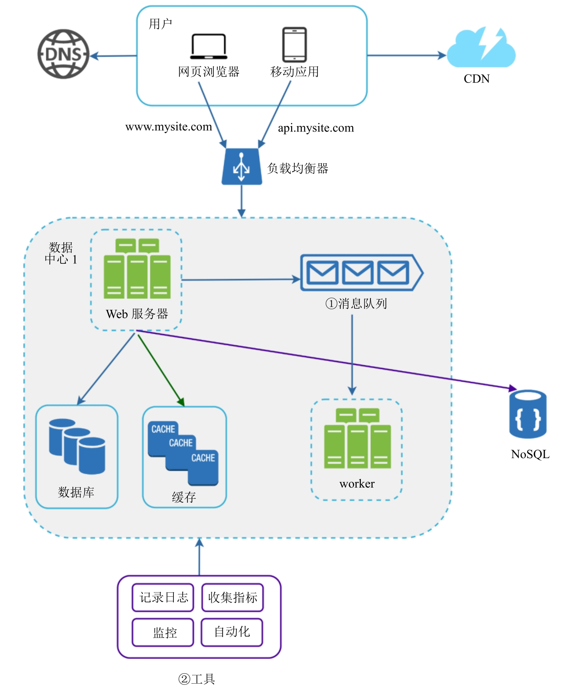

# 系统设计

[system-design-primer](https://github.com/donnemartin/system-design-primer/blob/master/README-zh-Hans.md)

https://www.ireader.com/index.php?ca=Chapter.Index&pca=Chapter.Index&bid=13022630&cid=21

1. 描述使用场景，约束和假设

- 谁会使用它？
- 他们会怎样使用它？
- 有多少用户？
- 系统的作用是什么？
- 系统的输入输出分别是什么？
- 我们希望处理多少数据？
- 我们希望每秒钟处理多少请求？
- 我们希望的读写比率？

2. 创造一个高层级的设计
3. 设计核心组件
4. 扩展设计

不要简单的从最初的设计直接跳到最终的设计

系统设计首先需要确定需要解决的问题，然后列举不同的解决方案，权衡对比选择一种最好的方案

## 权衡与取舍

- 性能与可扩展性
- 延迟与吞吐量
- 可用性与一致性
  - 一致性 ─ 每次访问都能获得最新数据但可能会收到错误响应
  - 可用性 ─ 每次访问都能收到非错响应，但不保证获取到最新数据
  - 分区容错性 ─ 在任意分区网络故障的情况下系统仍能继续运行

## 负载均衡器

可以通过硬件（昂贵）或 HAProxy 等软件来实现

- SSL 终结 ─ 解密传入的请求并加密服务器响应，这样的话后端服务器就不必再执行这些潜在高消耗运算了。不需要再每台服务器上安装 X.509 证书。
- Session 留存 ─ 如果 Web 应用程序不追踪会话，发出 cookie 并将特定客户端的请求路由到同一实例。

负载均衡器方便横向扩展

**缺陷：**

- 如果没有足够的资源配置或配置错误，负载均衡器会变成一个性能瓶颈。
- 引入负载均衡器以帮助消除单点故障但导致了额外的复杂性。
- 单个负载均衡器会导致单点故障，但配置多个负载均衡器会进一步增加复杂性。

## 反向代理（web 服务器）

- **增加安全性** - 隐藏后端服务器的信息，屏蔽黑名单中的 IP，限制每个客户端的连接数。
- **提高可扩展性和灵活性** - 客户端只能看到反向代理服务器的 IP，这使你可以增减服务器或者修改它们的配置。
- **本地终结 SSL 会话** - 解密传入请求，加密服务器响应，这样后端服务器就不必完成这些潜在的高成本的操作。免除了在每个服务器上安装 X.509 证书的需要
- **压缩** - 压缩服务器响应
- **缓存** - 直接返回命中的缓存结果

## 数据库

### 关系型数据库

- 支持事务性
- 一致性高
- 并发能力差
- 不易扩展

### 数据库事务

**数据库事务：** 对数据库所做的一系列修改，在修改过程中，暂时不写入数据库，而是缓存起来，用户在自己的终端可以预览变化，直到全部修改完成，并经过检查确认无误后，一次性提交并写入数据库，在提交之前，必要的话所做的修改都可以取消。提交之后，就不能撤销，提交成功后其他用户才可以通过查询浏览数据的变化。

**事务特性：**

- 原子性 - 每个事务内部所有操作要么全部完成，要么全部不完成。
- 一致性 - 任何事务都使数据库从一个有效的状态转换到另一个有效状态。
- 隔离性 - 并发执行事务的结果与顺序执行事务的结果相同。
- 持久性 - 事务提交后，对系统的影响是永久的。

### 关系型数据库扩展技术

- **主从复制：** 主库只负责写入操作，并复制写入到一个或多个从库中，从库只负责读操作。树状形式的从库再将写入复制到更多的从库中去。如果主库离线，系统可以以只读模式运行，直到某个从库被提升为主库或有新的主库出现。

- **主主复制：** 两个主库都负责读操作和写操作，写入操作时互相协调。如果其中一个主库挂机，系统可以继续读取和写入。

- **联合：** 联合（或按功能划分）将数据库按对应功能分割。例如，你可以有三个数据库：论坛、用户和产品，而不仅是一个单体数据库，从而减少每个数据库的读取和写入流量，减少复制延迟。较小的数据库意味着更多适合放入内存的数据，进而意味着更高的缓存命中几率。没有只能串行写入的中心化主库，你可以并行写入，提高负载能力。

- **分片：** 分片将数据分配在不同的数据库上，使得每个数据库仅管理整个数据集的一个子集。以用户数据库为例，随着用户数量的增加，越来越多的分片会被添加到集群中。

### NoSQL

NoSQL 是键-值数据库、文档型数据库、列型数据库或图数据库的统称

- 并发能力强
- 一致性差
- 易扩展

- **键-值存储：** 通常用于存储简单数据模型或频繁修改的数据，如存放在内存中的缓存。键-值存储提供的操作有限，如果需要更多操作，复杂度将转嫁到应用程序层面。
- **文档类型存储：** 文档类型存储以文档（XML、JSON、二进制文件等）为中心,文档可以根据集合、标签、元数据或者文件夹组织。尽管不同文档可以被组织在一起或者分成一组，但相互之间可能具有完全不同的字段。
- **列型存储：** 类型存储的基本数据单元是列（名／值对）。列可以在列族（类似于 SQL 的数据表）中被分组。超级列族再分组普通列族。你可以使用行键独立访问每一列，具有相同行键值的列组成一行
- **列型存储：** 一个节点对应一条记录，一个弧对应两个节点之间的关系。图数据库被优化用于表示外键繁多的复杂关系或多对多关系。图数据库为存储复杂关系的数据模型，如社交网络，提供了很高的性能。它们相对较新。

**适合 NoSQL 的示例数据：**

- 埋点数据和日志数据
- 排行榜或者得分数据
- 临时数据，如购物车
- 频繁访问的（“热”）表
- 元数据／查找表

## 缓存

- 客户端缓存
- CDN 缓存
- Web 服务器缓存
- 数据库缓存：数据库的默认配置中通常包含缓存级别，针对一般用例进行了优化。调整配置，在不同情况下使用不同的模式可以进一步提高性能。
- 应用缓存：Redis
- 数据库查询级别的缓存：当你查询数据库的时候，将查询语句的哈希值与查询结果存储到缓存中

### 何时更新缓存

#### 缓存模式

应用从存储器读写。缓存不和存储器直接交互，应用执行以下操作：

1. 在缓存中查找记录，如果所需数据不在缓存中
2. 从数据库中加载所需内容
3. 将查找到的结果存储到缓存中
4. 返回所需内容

#### 直写模式

应用使用缓存作为主要的数据存储，将数据读写到缓存中，而缓存负责从数据库中读写数据。读取刚写入的数据很快。相比读取数据，用户通常比较能接受更新数据时速度较慢。缓存中的数据不会过时。

1. 应用向缓存中添加/更新数据
2. 缓存同步地写入数据存储
3. 返回所需内容

#### 回写模式

与直写模式的区别就是异步写入数据

#### 刷新

在缓存到期之间刷新最近访问过的内容

## 异步

异步工作流有助于减少那些原本顺序执行的请求时间。它们可以通过提前进行一些耗时的工作来帮助减少请求时间，比如定期汇总数据。

### 消息队列

不去阻塞用户操作，作业在后台处理。在此期间，客户端可能会进行一些处理使得看上去像是任务已经完成了。例如，如果要发送一条推文，推文可能会马上出现在你的时间线上，但是可能需要一些时间才能将你的推文推送到你的所有关注者那里去。

### 任务队列

任务队列接收任务及其相关数据，运行它们，然后传递其结果。 它们可以支持调度，并可用于在后台运行计算密集型作业。

### 背压

如果队列开始明显增长，那么队列大小可能会超过内存大小，导致高速缓存未命中，磁盘读取，甚至性能更慢。背压可以通过限制队列大小来帮助我们，从而为队列中的作业保持高吞吐率和良好的响应时间。一旦队列填满，客户端将得到服务器忙或者 HTTP 503 状态码，以便稍后重试。客户端可以在稍后时间重试该请求，也许是指数退避。

## 常见延时数

|               动作                |      时间      |  换算  |
| :-------------------------------: | :------------: | :----: |
|            L1 缓存访问            |     0.5 ns     | 0.5ns  |
|           分支预测错误            |      5 ns      |  5ns   |
|            L2 缓存访问            |      7 ns      |  7 ns  |
|            互斥锁/解锁            |     25 ns      | 25 ns  |
|             内存访问              |     100ns      | 100ns  |
|        使用 Zippy压缩 1KiB        |    3,000 ns    |  3 µs  |
|     通过 1 Gbps 网络发送 2KiB     |   20,000 ns    | 20 µs  |
|           SSD 随机读取            |   150,000 ns   | 150 µs |
|        内存中连续读取 1 MB        |   250,000 ns   | 250 µs |
|       同一个数据中心的来回        |   500,000 ns   | 0.5 ms |
|     从 SSD 上连续读取 1 MB\*      |  1,000,000 ns  |  1 ms  |
|           机械磁盘寻道            | 10,000,000 ns  | 10 ms  |
|       机械磁盘连续读取 1 MB       | 20,000,000 ns  | 20 ms  |
| 发送数据包 加州-&gt;荷兰-&gt;加州 | 150,000,000 ns | 150 ms |

同一个数据中心，从远程服务器的内存中读取数据比从硬盘中读取要快

## 常见系统架构

NoSQL 中存储状态数据，比如 Sesion, Cookie 或 用户信息

## 概念

- **纵向扩展：** 提升服务器的能力（CPU、RAM等）
- **横向扩展：** 也叫作向外扩展，指的是为你的资源池添加更多服务器
