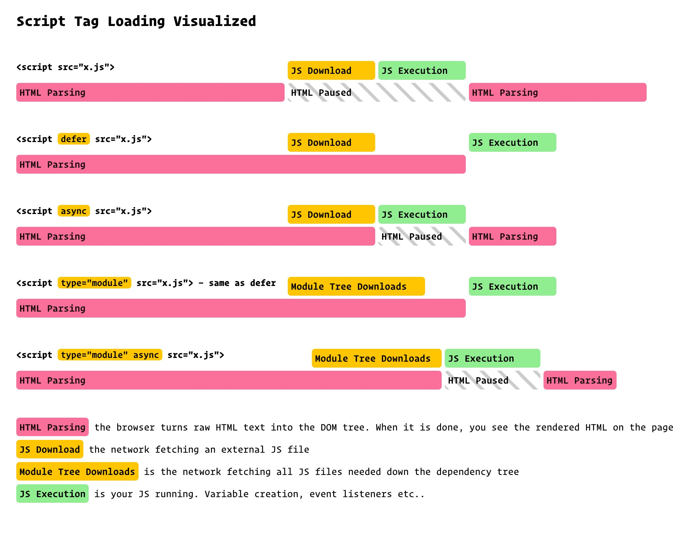

# JavaScript 基础

> 参考[前端学习文档](https://kiraraty.github.io/fe-doc/#/interview/javascript%E5%9F%BA%E7%A1%80)

## 数据类型

### 八种数据类型

`undefined`、`null`、`Number`、`String`、`Boolean`、`Object`、`Symbol`、`BigInt`

- 使用 `void` 对表达式求值都返回 `undefined`
- `typeof null` 结果为 object
- 在进行转换的时候我们可以看出对于引用类型的值都会转为`true`,基本类型 Number 中 0、NaN 以及 ''、null、undefined 会被转换为 false
- `NaN` 不等于 `NaN`，只有使用 `Object.is()` 时才相等
- Symbol 的使用

```js
const symbol = Symbol('foo') // 接受一个可选的描述符

// 共享symbol
// 首先在全局查找是否有 ssn 的 symbol，如果有就返回，没有就创建
const sharedSymbol = Symbol.for('ssn')

// 获取symbol的键
// 只能获得 Symbol.for 的 key，Symbol() 会返回 undefined，即使传入 description
Symbol.keyFor(sharedSymbol) // ssn

// Symbol.toStringTag
let myObj = {}
Object.defineProperty(myObj, Symbol.toStringTag, { value: 'Yuhua' })
console.log(Object.prototype.toString.call(myObj)) //[object Yuhua]
```

## JS 类型隐藏式转换

[你所忽略的 js 隐式转换](https://juejin.cn/post/6844903557968166926)

[MDN Symbol.toPrimitive](https://developer.mozilla.org/zh-CN/docs/Web/JavaScript/Reference/Global_Objects/Symbol/toPrimitive)

## 检测数据类型的方法

- typeof 只能判断八种类型，在基本数据类型中去掉 `null`，多一个 `function`
- instanceOf 只能正确判断引用数据类型，而不能判断基本数据类型
- constructor

```js
console.log((2).constructor === Number) // true
console.log(true.constructor === Boolean) // true
console.log('str'.constructor === String) // true
```

- Object.prototype.toString.call()

## `Object.is() == ===` 区别

1. `==` 两边值类型不同时，先进行类型转换再比较
2. `===` 严格相等
3. `Object.is()` 与`===` 基本一样，区别在 +0 不等于 -0，NaN 等于自身

## 类数组

- 函数里面的参数对象 arguments
- 用 getElementsByTagName/ClassName/Name 获得的 HTMLCollection
- 用 querySelector 获得的 NodeList

### 类数组转为数组

1. 借助数组方法

```js
const arrayLike = {
  0: 'java',
  1: 'script',
  length: 2,
}
Array.prototype.push.call(arrayLike, 'jack', 'lily')
console.log(arrayLike)
// {0: "java", 1: "script", 2: "jack", 3: "lily", length: 4}
```

Array.prototype.slice.call(arrayLike)

2. 借用 ES6 方法

- `Array.from(arrayLike)`
- `[...arguments]`

## 取消请求

axios 也支持

```js
const controller = new AbortController()
fetch('', {
  signal: controller.signal,
})
controller.abort()
```

## script 标签执行顺序



[图片来源](https://twitter.com/wesbos/status/1694081235729928529/photo/1)

1. async 属性，异步请求脚本。如果请求完成时，HTML 还没有解析完，会暂停 HTML 解析，执行 JS 代码。多个 async script 标签，执行顺序不确定
2. defer 属性，异步请求脚本，等待 HTML 解析完毕再执行 JS 代码。多个 defer script 标签，按照 HTML 中出现的顺序执行
3. 动态创建 DOM 方式

## setInterval 缺点

1. 使用 setInterval 时，某些间隔可能会被跳过
2. 可能多个定时器会连续执行

一般用 setTimeout 模拟 setInterval，来规避掉上面的缺点

## Object 方法

- `Object.assign(target,source1,source2,...)` 对象的合并
- `Object.create(prototype,[propertiesObject])` 使用指定的原型对象及其属性去创建一个新的对象
- `Object.defineProperties(obj,props)` 直接在一个对象上定义新的属性或修改现有属性，并返回该对象。
- `Object.defineProperty(obj,prop,descriptor)` 在一个对象上定义一个新属性，或者修改一个对象的现有属性， 并返回这个对象。
- `Object.keys(obj)`、`Object.values(obj)`、`Object.entries(obj)`
- `Object.fromEntries(obj)` 把键值对列表转换为一个对象。
- `Object.getOwnPropertyNames()` 返回一个由指定对象的所有自身属性的属性名（包括不可枚举属性但不包括 Symbol 值作为名称的属性）组成的数组
- `Object.getOwnPropertySymbols(obj)` 包含对象自身的所有 Symbol 属性
- `Object.getOwnPropertyDescriptor()` ES5，返回某个对象属性的描述对象
- `Object.getOwnPropertyDescriptors()` ES2017，返回指定对象所有自身属性（非继承属性）的描述对象
- `Object.setPrototypeOf(obj,prototype)` 设置对象的原型对象
- `Object.getPrototypeOf(obj)` 读取一个对象的原型对象
- `Object.is()` 判断两个值是否相同
- `Object.freeze()` 冻结一个对象
- `Object.isFrozen()` 判断一个对象是否被冻结
- `Object.seal(obj)` 密封对象，不能添加、删除或配置属性
- `Object.preventExtensions()` 可修改，删除现有属性，不能添加新属性
- `Object.prototype.isPrototypeOf()` 判断一个对象是否存在于另一个对象的原型链上。
- `Object.prototype.hasOwnProperty(key)` 判断对象自身属性中是否具有指定的属性

Object.keys(obj)、Object.values(obj)、Object.entries(obj)与`for-in`的区别是不会枚举原型链中的属性

## Promise 方法

- `Promise.all(iterable)` 这个方法返回一个新的 promise 对象，等到所有的 promise 对象都成功或有任意一个 promise 失败
- `Promise.allSettled(iterable)` 等到所有 promise 都已敲定（每个 promise 都已兑现或已拒绝）
- `Promise.any(iterable)` 接收一个 promise 对象的集合，当其中的任意一个 promise 成功，就返回那个成功的 promise 的值
- `Promise.race(iterable)` 等到任意一个 promise 的状态变为已敲定
- `Promise.reject(reason)` 返回一个状态为已拒绝的 Promise 对象
- `Promise.resolve(value)` 返回一个状态由给定 value 决定的 Promise 对象。如果该值是 thenable（即，带有 then 方法的对象），返回的 Promise 对象的最终状态由 then 方法执行结果决定；否则，返回的 Promise 对象状态为已兑现，并且将该 value 传递给对应的 then 方法。一般用于不知道一个值是不是 promise，使用 `Promise.resolve(value)` 包一下

## 判断对象是否为空

1. 将 json 对象转化为 json 字符串，再判断该字符串是否为"{}"
2. for in 循环判断
3. Object.getOwnPropertyNames()，Object.keys()方法，返回一个数组，判断 length

## 创建空对象

```js
const obj = Object.create(null)
```

## 模块化

### 什么是模块化

将 JS 分割成不同职责的 JS，解耦功能，来用于解决全局变量污染、 变量冲突、代码冗余、依赖关系难以维护等问题的一种 JS 管理思想，这就是模块化的过程。

### CommonJS 特性

- 模块由 JS 运行时实现
- 可以动态加载的，对每一个加载都存在缓存
- 模块同步加载并执行模块文件
- 模块输出的是一个值的拷贝
- 模块可以多次加载，但模块只会执行一次

### ES Module 特性

- 静态的，不能放在块级作用域内，代码发生在编译时
- 模块导出的是值的引用，原始值变了，import 加载的值也会跟着变
- 容易实现 Tree Shaking 和 Code Splitting

## ES Module 的解析过程

1. 构建（Construction），根据地址查找 js 文件，并且下载，将其解析成模块记录（Module Record）
2. 实例化（Instantiation），对模块记录进行实例化，并且分配内存空间，解析模块的导入和导出语句，把模块指向 对应的内存地址。
3. 运行（Evaluation），运行代码，计算值，并且将值填充到内存地址中

## 函数式编程

### 纯函数

纯函数必须满足以下两个属性

- 函数总是为相同的参数提供相同的返回值。 这意味着该函数不能依赖于任何可变状态。
- 该函数不会引起任何副作用。副作用可能包括 I/O（例如，写入控制台或日志文件）、修改可变对象、重新赋值变量等

### 复合函数

- 我们可以组合任意数量的函数（不限于两个）
- 组合函数的一种方法是从一个函数获取输出并将其传递给下一个函数（即 f(g(x))）

### 高阶函数

接受函数作为参数，或者返回一个函数

## 杂项

- `requestAnimationFrame` 是在重绘之前执行，此时还没有更新 Dom；`requestIdleCallback` 是在浏览器空闲时期被调用
