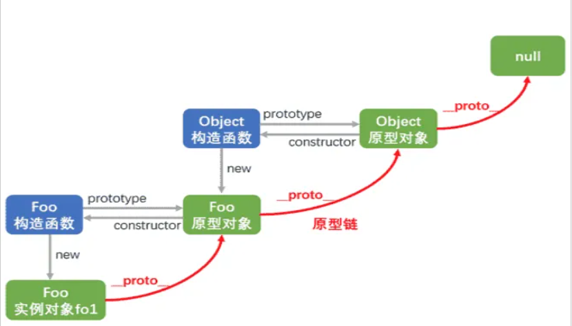

# JavaScript 进阶

> 参考[前端学习文档](https://kiraraty.github.io/fe-doc/#/interview/javascript%E8%BF%9B%E9%98%B6)

## let const var

|                    | var | let | const |
| ------------------ | :-: | :-: | :---: |
| 是否有块级作用域   |  ×  |  ✔  |   ✔   |
| 是否存在变量提升   |  ✔  |  ×  |   ×   |
| 是否添加全局属性   |  ✔  |  ×  |   ×   |
| 能否重复声明变量   |  ✔  |  ×  |   ×   |
| 是否存在暂时性死区 |  ×  |  ✔  |   ✔   |
| 是否必须设置初始值 |  ×  |  ×  |   ✔   |
| 能否改变指针指向   |  ✔  |  ✔  |   ×   |

## 作用域和作用域链

### 作用域

作用域是在程序运行时代码中的某些特定部分中变量、函数和对象的可访问性

### 作用域分类

作用域又分为`全局作用域`和`局部作用域`。在 ES6 之前，局部作用域只包含了`函数作用域`，ES6 的到来为我们提供了 `块级作用域`（由一对花括号包裹），可以通过新增命令 let 和 const 来实现

### 作用域链

概念： 多个作用域对象连续引用形成的链式结构

函数的作用域是在函数定义的时候就被决定了，与函数在哪里被调用无关

## 原型和原型链

在 JavaScript 中是使用构造函数来新建一个对象的，每一个构造函数的内部都有一个 prototype 属性，它的属性值是一个对象，这个对象包含了可以由该构造函数的所有实例共享的属性和方法。

当访问一个对象的属性时，如果这个对象内部不存在这个属性，那么它就会去它的原型对象里找这个属性，这个原型对象又会有自己的原型，于是就这样一直找下去，也就是原型链的概念



> 图片来源与网络

```js
Person.prototype = {
  getName: function () {},
}
var p = new Person('hello')
p.constructor = Person
console.log(p.__proto__ === Person.prototype) // true
console.log(p.__proto__ === p.constructor.prototype) // true

p.__proto__ // Person.prototype
Person.prototype.__proto__ // Object.prototype
p.__proto__.__proto__ //Object.prototype
p.__proto__.constructor.prototype.__proto__ // Object.prototype
Person.prototype.constructor.prototype.__proto__ // Object.prototype
p1.__proto__.constructor // Person
Person.prototype.constructor // Person
```

## 空值合并运算符（??）

当左侧的操作数为 null 或者 undefined 时，返回其右侧操作数，否则返回左侧操作数。

```js
0 || 3 // 返回3
0 ?? 3 // 返回0
```

## Generator 函数

async 就是通过 Generator 函数实现 [async/await 原理](https://juejin.cn/post/7007031572238958629)

Generator 函数可以返回（yield）多个值，在调用函数时，不会运行其代码，返回一个被称为 “generator object” 的特殊对象，可以与 `iterable` 结合使用

```js
function* generateSequence() {
  yield 1
  yield 2
  return 3
}
const res = generateSequence()
console.log(res.next()) // { value: 1, done: false }
console.log(res.next()) // { value: 2, done: false }
console.log(res.next()) // { value: 3, done: true }
```

### “yield” 是一条双向路

它不仅可以向外返回结果，而且还可以将外部的值传递到 generator 内。

```js
function* gen() {
  const result = yield '2 + 2 = ?'
  console.log(result)
}
const res = gen()
console.log(res.next()) // { value: '2 + 2 = ?', done: false }
res.next(4) // 4
```

`generator.throw` yield 可以接受值，那么它也可以抛出一个错误

`generator.return(value)` 完成 generator 的执行并返回给定的 value

## 并发和并行的理解

并发：当有多个线程在操作时,如果系统只有一个 CPU,则它根本不可能真正同时进行一个以上的线程，它只能把 CPU 运行时间划分成若干个时间段,再将时间 段分配给各个线程执行，在一个时间段的线程代码运行时，其它线程处于挂起状。.这种方式我们称之为并发(Concurrent)。

并行：当系统有一个以上 CPU 时,则线程的操作有可能非并发。当一个 CPU 执行一个线程时，另一个 CPU 可以执行另一个线程，两个线程互不抢占 CPU 资源，可以同时进行，这种方式我们称之为并行(Parallel)。

## 执行上下文

当 JS 引擎解析到可执行代码片段（通常是函数调用阶段）的时候，就会先做一些执行前的准备工作，这个 “准备工作”，就叫做 "执行上下文

### 执行上下文的类型

- **全局执行上下文** ：这是默认或者说是最基础的执行上下文，一个程序中只会存在一个全局上下文，它在整个 javascript 脚本的生命周期内都会存在于执行堆栈的最底部不会被栈弹出销毁。全局上下文会生成一个全局对象（以浏览器环境为例，这个全局对象是 window），并且将 this 值绑定到这个全局对象上。
- **函数执行上下文** ：每当一个函数被调用时，都会创建一个新的函数执行上下文（不管这个函数是不是被重复调用的）
- **Eval 函数执行上下文** ：执行在 eval 函数内部的代码也会有它属于自己的执行上下文

## 闭包

### 什么是闭包

闭包是一个函数在创建时允许该自身函数访问并操作该自身函数以外的变量时所创建的作用域。

1. 「函数」和「函数内部能访问到的变量」的总和，就是一个闭包
2. 函数和对其词法环境的引用捆绑在一起，这样的组合就是闭包

### 闭包的优缺点

- 好处
  - 避免污染全局变量
  - 形成不被污染的栈内存
- 坏处
  - 增大内存的使用量
  - 容易造成内存泄露

### 用途

- 延长变量的生命周期：闭包使得内部函数可以继续访问外部函数的变量，即使外部函数已经执行完毕。比如函数柯里化
- 封装私有变量和方法（比如 hooks）

### JS 内存分类

**堆内存** ：储存引用类型值，对象类型就是键值对，函数就是代码字符串
**栈内存** ：提供代码执行环境和储存基本类型值，函数执行完后函数的私有作用域就会被释放

## this

this 是执行上下文中的一个属性，它指向最后一次调用这个方法的对象。在实际开发中，this 的指向可以通过四种调用模式来判断。

- 函数调用模式，当一个函数不是一个对象的属性时，直接作为函数来调用时，非严格模式下 this 指向全局对象
- 方法调用模式
- 构造器调用模式，如果一个函数用 new 调用时，函数执行前会新创建一个对象，this 指向这个新创建的对象
- apply 、 call 和 bind 调用模式

## 箭头函数

1. 函数体内的 this 对象，继承的是外层代码块的 this。
2. 不可以当作构造函数，也就是说，不可以使用 new 命令，否则会抛出一个错误。
3. 不可以使用 arguments 对象，该对象在函数体内不存在。如果要用，可以用 rest 参数代替。
4. 不可以使用 yield 命令，因此箭头函数不能用作 Generator 函数。
5. 箭头函数没有自己的 this，所以不能用 call()、apply()、bind()这些方法去改变 this 的指向

## 垃圾回收机制

### 引用计数法

优点：

- 可即刻回收：当被引用数值为 0，对象马上会把自己作为空闲空间连到空闲链表上。也就是说，在变成垃圾的时候就立刻被回收
- 因为是及时回收，那么程序不会暂停去单独使用很长一段时间的 GC，那么最大暂停时间很短
- 不用去遍历堆里面的所有活动对象和非活动对象

缺点：

- 计数器需要占很大的位置
- 最大的劣势是无法解决循环引用无法回收的问题

### 标记清除法

优点：实现简单，解决了循环引用的问题

缺点：

- 造成内存碎片化
- 再分配时遍历次数多，如果一直没有找到合适的内存块大小，那么会遍历空闲链表（保存堆中所有空闲地址空间的地址形成的链表）一直遍历到尾端。

标记清除是浏览器常见的垃圾回收方式，当变量进入执行环境时，就标记这个变量“进入环境”，被标记为“进入环境”的变量是不能被回收的，因为他们正在被使用。当变量离开环境时，就会被标记为“离开环境”，被标记为“离开环境”的变量会被内存释放。

## V8 对 GC(Garbage Collection)的优化

### 分代式垃圾回收

V8 采用分代式垃圾回收策略，将堆内存分为新生代和老生代，分别采用不同的垃圾回收器来管控。新生代的对象存活时间短，占内存小，老生代的对象存活时间长，占内存大

### 新生代垃圾回收

1. 垃圾回收管理器将新生代的内存一分为二，分别是 `使用区` 和 `空闲区`
2. 新加入的内存会存放到使用区，当使用区块被写满时执行一次垃圾回收
3. 新生代垃圾回收器对使用区的活动对象进行标记，将使用区的活动对象复制进空闲区并进行排序，将非活动对象占用的空间清理掉
4. 角色互换，把原来的使用区变成空闲区，把原来的空闲区变成使用区

- 当一个对象经过多次复制后依然存活，它将会被认为是生命周期较长的对象，随后会被移动到老生代中
- 复制一个对象到空闲区时，空闲区空间占用超过了 25%，那么这个对象会被直接晋升到老生代空间中

### 老生代垃圾回收

1. 标记阶段，从一组根元素开始，递归遍历这组根元素，遍历过程中能到达的元素称为活动对象
2. 清除阶段，将非活动对象清除掉
3. 标记结束后，将活着的对象（即不需要清理的对象）向内存的一端移动，最后清理掉边界的内存

### 并行回收(Parallel)

新生代对象空间就采用并行策略，在执行垃圾回收的过程中，会启动了多个线程来负责新生代中的垃圾清理操作，这些线程同时将对象空间中的数据移动到空闲区域，这个过程中由于数据地址会发生改变，所以还需要同步更新引用这些对象的指针，此即并行回收。

这个过程中，主线程处于全全停顿的状态，不需要考虑内存中对象的引用关系改变

### 增量标记与懒性清理

**增量：** 就是将一次 GC 标记的过程，分成了很多小步，每执行完一小步就让应用逻辑执行一会儿，这样交替多次后完成一轮 GC 标记

**三色标记法(暂停与恢复)：**

- 白色指的是未被标记的对象
- 灰色指自身被标记，成员变量（该对象的引用对象）未被标记
- 黑色指自身和成员变量皆被标记

1. 最初所有的对象都是白色，意味着回收器没有标记它们
2. 从一组根对象开始，先将这组根对象标记为灰色并推入到标记工作表
3. 当回收器从标记工作表中弹出对象并访问它的引用对象时，将其自身由灰色转变成黑色，并将自身的下一个引用对象转为灰色
4. 一直走下去，直到没有可标记灰色的对象，也就是无可达（无引用到）的对象
5. 剩下的所有白色对象都是无法到达的，即等待回收

当恢复 GC 执行时，可以直接通过当前内存中有没有灰色节点来判断整个标记是否完成

### 写屏障(增量中修改引用)

一旦有黑色对象引用白色对象，该机制会强制将引用的白色对象改为灰色，从而保证下一次增量 GC 标记阶段可以正确标记，这个机制也被称作 `强三色不变性`

### 懒性清理

增量标记完成后，惰性清理就开始了。当增量标记完成后，假如当前的可用内存足以让我们快速的执行代码，其实我们是没必要立即清理内存的，可以将清理过程稍微延迟一下，让 JavaScript 脚本代码先执行，也无需一次性清理完所有非活动对象内存，可以按需逐一进行清理直到所有的非活动对象内存都清理完毕，后面再接着执行增量标记

### 并发回收(Concurrent)

主线程在执行 JavaScript 的过程中，辅助线程能够在后台完成执行垃圾回收的操作，辅助线程在执行垃圾回收的时候，主线程也可以自由执行而不会被挂起。
堆中的对象引用关系随时都有可能发生变化，这时辅助线程之前做的一些标记或者正在进行的标记就会要有所改变，所以它需要额外实现一些读写锁机制来控制这一点

## Proxy 和 Reflect

Proxy 与 Reflect 搭配使用是为了保证正确的 this 指向
