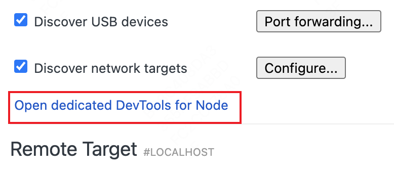

# Debug

> [一文搞懂前端各种调试方法的原理](https://mp.weixin.qq.com/s/QHE32rzlZHqp1yWMfxaC9A)

## 打开 protocol monitor 面板

protocol monitor 是一项实验性质

在 devtools settings 中启用，然后调出控制面板搜索 protocol monitor

## Chrome Devtools 调试 Node

> [Node 官方调试指南](https://nodejs.org/en/guides/debugging-getting-started/)

devtools 其实是一个页面，可以在 Chrome 打开 `devtools://devtools/bundled/inspector.html` 查看，[源码地址](https://source.chromium.org/chromium/chromium/src/+/main:out/Debug/gen/third_party/devtools-frontend/src/front_end/inspector.html;bpv=0;bpt=0)

Node 进程必须阻塞

第一步

```sh
node --inspect server.js
```

第二步
在 chrome 打开 `chrome://inspect/#devices`



启动 node inspect 的时候，chrome 会自动捕获

或者访问 `http://127.0.0.1:9229/json` 获取 `devtoolsFrontendUrl`，然后新建 tab 页面打开

---

可以在 `Console` 面板中看到 log 打印，也可以在 `Sources` 面板对代码进行断点调试

### 调试 Cli 程序

可以修改 node_modules/.bin 下对应的 cli 程序，例如修改 vite 的可执行文件：

```sh
#!/bin/sh
basedir=$(dirname "$(echo "$0" | sed -e 's,\\,/,g')")
exec node --inspect  "$basedir/../vite/bin/vite.js" "$@"
```

## CDP

[Chrome DevTools Protocol](https://chromedevtools.github.io/devtools-protocol/)


当点击小三角对 `set` 进行展开时，devtools 通过请求获取 `set` 的信息，然后进行展示

---

该协议把操作划分为不同的域(domain)，比如 DOM、Debugger、Network、Console 和 Timeline 等，可以理解为 DevTools 中的不同功能模块。

每个域(domain)定义了它所支持的 command 和它所产生的 event。每个 command 包含 request 和 response 两部分，request 部分指定所要进行的操作以及操作说要的参数，response 部分表明操作状态，成功或失败。

## Chrome DevTools Frontend

> [深入理解 Chrome DevTools](https://zhaomenghuan.js.org/blog/chrome-devtools.html)
>
> [Chrome DevTools Frontend 运行原理浅析](https://zhaomenghuan.js.org/blog/chrome-devtools-frontend-analysis-of-principle.html)
>
> [运行 Chrome DevTools Frontend 项目](https://juejin.cn/post/7157368138214932510)

每一个 DevTools 都是一个单独的进程，防止页面阻塞导致 devtools 不可用

## Chrome DevTools Backend

[Node Inspector 解析](https://theanarkh.github.io/understand-nodejs/chapter24-Inspector)

Node Inspector 就是一种 DevTools 后端，架起前端与 V8 沟通的桥梁
