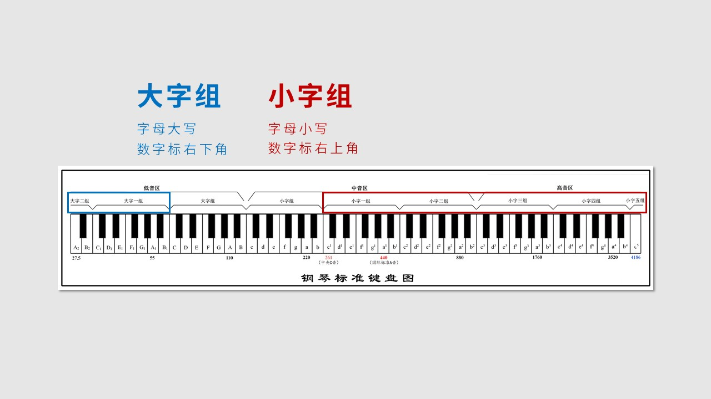
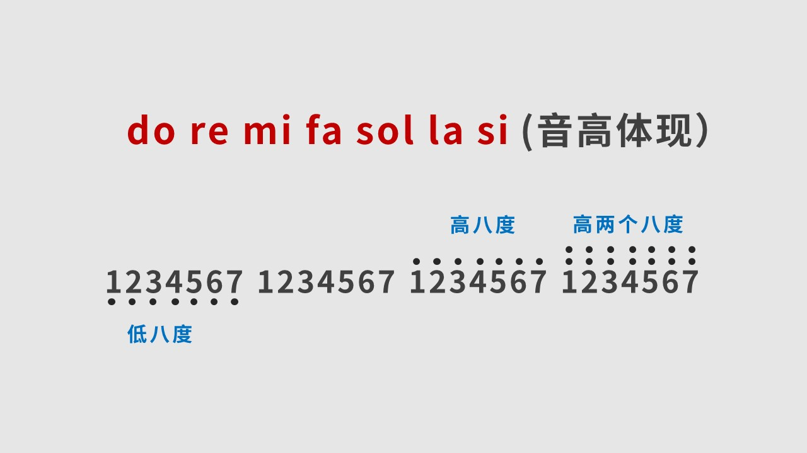

# 乐理

## 钢琴键盘与音符

7个白键，5个黑键为一组

白键：CDFGHAB

半音：两个相邻音之间的关系

全音：两个音之间隔着一个音，就是全音关系

黑键的命名：以 CD 之间的黑键举例，可以叫作 `C♯` 或 `D♭`

还原号 `♮` : `C♯` 加一个还原号变成 C，`D♭` 加一个还原号变成 D

重升符 𝄪 : 生两次半音

重降符 𝄫 : 降两次半音

## 节奏

音符时值：全音符、二分音符、四分音符、八分音符...，每一个时长缩短一倍

拍号： 例如 `3/4`，以四分音符为一拍，每小节有三拍

BPM：每分钟节拍数

附点音符：在原有音符的基础上延长一半，写法为在音符后加点，例如附点 X 分音符=X分音符+X分音符的一半

三连音：三个音符表示同等时间的两个音，比如：四分音符三连音，就是一个二分音符的时间

## 唱名与简谱

1234567 与音名没有固定的对应关系，简谱中需要给出1等于哪个音名

C自然大调：CDEFGAB，音之间的关系为 全全半全全全半（自然大调音之间的关系必须按这个来）

自然大调（黑键）：黑键出发的调式都是以将X为首音

自然小调：简谱为 6712345

A自然小调：ABCDEFGA，音之间的排列规律为 全半全全半全全

音程：音与音之间的距离，单位是度。钢琴上的白键距离，黑键需要用还原符还原。

纯X度：分别有 1度、4度、5度、8度

大X度：分别有 2度、3度、6度、7度
